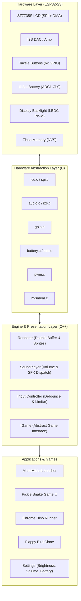
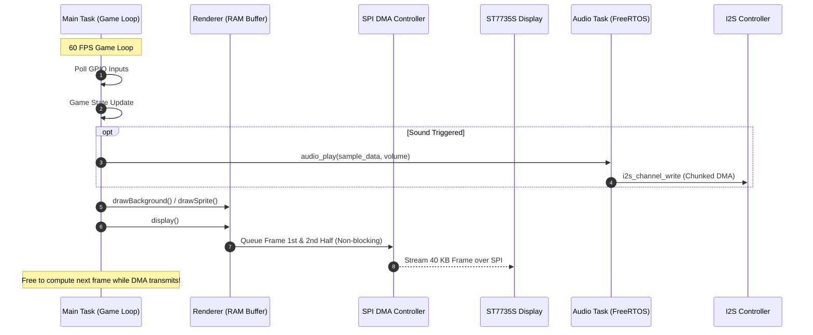

# 🎮 ESP32-S3 Retro Handheld Game Console

<div align="center">


**A complete, low-level embedded retro handheld console powered by Espressif ESP32-S3.**  
*Custom 2D graphics engine with DMA double-buffering, asynchronous I2S audio task, calibrated battery telemetry, and classic mini-games written in modern C++.*

[Features](#-key-features) • [Architecture](#-system-architecture) • [Hardware & Pinout](#-hardware-specifications--pinout) • [Built-in Games](#-built-in-games) • [Getting Started](#-getting-started)

</div>

---

## 🌟 Highlights for Portfolio & Technical Review

- **Zero Heavy External GUI Libraries:** Built from scratch on bare-metal ESP-IDF drivers — custom lightweight 2D sprite/shape renderer with color-key transparency.
- **DMA Double-Buffering Pipeline:** Full-frame asynchronous SPI transactions via hardware DMA to maximize frame rates and eliminate screen tearing.
- **Multitasked FreeRTOS Audio:** Dedicated audio processing task delivering asynchronous 16-bit 16 kHz PCM sound effects over I2S without stalling the game loop.
- **Clean Embedded Architecture:** Clear separation between low-level C peripheral drivers (SPI, I2S, ADC, PWM, NVS) and object-oriented C++ game runtime (`IGame` polymorphism).
- **Persistent Storage & Power Telemetry:** Non-Volatile Storage (NVS) for persistent high scores and settings, plus hardware curve-calibrated ADC for real-time Li-ion battery level calculation.

---

## 🏗 System Architecture

The firmware decouples hardware abstraction from gameplay state machines. Low-level drivers expose C APIs, while the game engine uses an abstract object-oriented state pattern.



### ⚡ FreeRTOS Task & Graphics Execution Flow



---

## 🕹 Built-in Games & UI

| Game / Screen | Description | Key Technical Features |
| :--- | :--- | :--- |
| **Pickle Snake 🥒** | A whimsical reimagining of Classic Snake featuring an animated pickle protagonist! | Dynamic snake body corner rendering (`up-right`, `down-left`, etc.), randomized food spawns, self-collision detection, persistent high-score saving via NVS. |
| **Chrome Dino Runner** | The iconic endless desert runner. | Jump & duck physics, multi-variant obstacles (cacti, pterodactyls), acceleration over time, sprite animation cycles, high-score tracking. |
| **Flappy Bird Clone** | Classic gravity-defying tap game. | Velocity & gravity physics integration, scrolling pipe generation, tight bounding-box collision detection, audio cues on pass/crash. |
| **Settings & Dashboard** | Console configuration menu. | Logarithmic gamma-corrected brightness control (`LEDC` PWM), master volume & mute toggles, live Li-ion voltage & battery percentage meter. |

---

## 🔌 Hardware Specifications & Pinout

### 💻 Microcontroller Specifications
- **MCU:** Espressif ESP32-S3 (Dual-core Xtensa® LX7, up to 240 MHz, 512 KB SRAM)
- **Operating Framework:** ESP-IDF (v5.x / v6.x) with C++17 runtime
- **OS:** FreeRTOS (SMP Dual-core scheduling)

### 📌 Peripheral Pin Mapping

| Peripheral | Function | ESP32-S3 GPIO | Description |
| :--- | :--- | :---: | :--- |
| **ST7735S LCD** | `MOSI` | **GPIO 11** | SPI Data Out |
| | `SCLK` | **GPIO 12** | SPI Clock (15–26 MHz) |
| | `CS` | **GPIO 47** | Chip Select |
| | `DC` | **GPIO 48** | Data / Command Control |
| | `RST` | **GPIO 21** | Hardware Reset |
| | `BL` | **GPIO 17** | Backlight Control via LEDC PWM (5 kHz) |
| **I2S Audio** | `DIN` | **GPIO 10** | Serial Data (PCM) |
| | `BCLK` | **GPIO 14** | Bit Clock |
| | `LRCK / WS` | **GPIO 13** | Word Select (Left/Right Clock, 16 kHz) |
| **Gamepad Inputs** | `ACTION (A)` | **GPIO 4** | Active-low input (Internal pull-up) |
| | `DOWN` | **GPIO 5** | Active-low input (Internal pull-up) |
| | `UP` | **GPIO 6** | Active-low input (Internal pull-up) |
| | `RIGHT` | **GPIO 7** | Active-low input (Internal pull-up) |
| | `LEFT` | **GPIO 15** | Active-low input (Internal pull-up) |
| | `BACK (B)` | **GPIO 16** | Active-low input (Internal pull-up) |
| **Battery Sensing** | `ADC_IN` | **GPIO 1** | ADC1 Channel 0, 12 dB Attenuation, Curve-fitting calibrated |

---

## 🎨 Graphics & Rendering Pipeline

- **Display Resolution:** 160 × 128 pixels (1.8" TFT).
- **Color Format:** 16-bit RGB565 (65,536 colors).
- **Transparency Engine:** Custom `MAGIC_COLOR` (hex `0x1FF8`) transparency keying for sprite overlays without alpha-channel memory overhead.
- **Memory Footprint:**
  - Double buffer: $160 \times 128 \times 2 \times 2 = 81{,}920 \text{ bytes}$ (DRAM DMA-capable internal memory).
  - Front buffer is continuously streamed by the SPI peripheral while the game engine renders the back buffer.

---

## 🔊 Audio Subsystem

- **Protocol:** I2S Mono 16-bit standard transmission at 16,000 Hz.
- **Architecture:** 
  - Sounds are stored in Flash as uncompressed 16-bit PCM arrays.
  - An independent FreeRTOS task streams chunks (256 samples / 512 bytes) to the I2S hardware FIFO with thread-safe mutex synchronization.
  - Software volume scaling with live gain calculation.

---

## 🚀 Getting Started

### Prerequisites

1. Install the official [ESP-IDF](https://docs.espressif.com/projects/esp-idf/en/latest/esp32s3/get-started/) (v5.1+ or v6.x recommended).
2. Set up the environment variables:
   ```bash
   # Linux/macOS
   . $HOME/esp/esp-idf/export.sh

   # Windows (PowerShell)
   . $env:USERPROFILE\esp\esp-idf\export.ps1
   ```

### Building & Flashing

```bash
# Clone the repository
git clone https://github.com/corki1337/esp32-console.git
cd esp32-console

# Set target to ESP32-S3
idf.py set-target esp32s3

# Build project
idf.py build

# Flash to device and start serial monitor (replace PORT with your COM/tty port)
idf.py -p COM3 flash monitor
```

---

## 📁 Repository Structure

```text
├── main/
│   ├── inc/                     # Public C & C++ Headers
│   │   ├── IGame.hpp            # Pure virtual base class for all games
│   │   ├── Renderer.hpp         # 2D graphics engine (sprites, text, primitives)
│   │   ├── SoundPlayer.hpp      # Audio dispatch & volume manager
│   │   ├── DinoGame.hpp         # Chrome Dino runner game
│   │   ├── BirdGame.hpp         # Flappy Bird clone
│   │   ├── SnakeGame.hpp        # Pickle Snake game
│   │   ├── Menu.hpp             # Application launcher
│   │   ├── Settings.hpp         # Console configuration menu
│   │   ├── sprites.hpp          # Compressed 16-bit bitmap sprite assets
│   │   ├── sounds.hpp           # 16-bit PCM audio assets
│   │   ├── lcd.h / spi.h        # ST7735S display & SPI DMA drivers
│   │   ├── audio.h / i2s.h      # FreeRTOS audio task & I2S driver
│   │   ├── adc.h / battery.h    # Battery curve & calibrated ADC
│   │   ├── gpio.h / pwm.h       # Button controller & backlight PWM
│   │   └── nvsmem.h             # Non-Volatile Storage (flash memory)
│   ├── src/                     # Implementations (.c / .cpp)
│   └── main.cpp                 # Application entry point & main game loop
├── CMakeLists.txt               # Top-level CMake project definition
└── sdkconfig                    # ESP-IDF configuration parameters
```

---

## 👤 Author & Portfolio

Developed with passion by **[corki1337](https://github.com/corki1337)**  
*Embedded Systems • C/C++ • ESP32 Hardware & Firmware*
